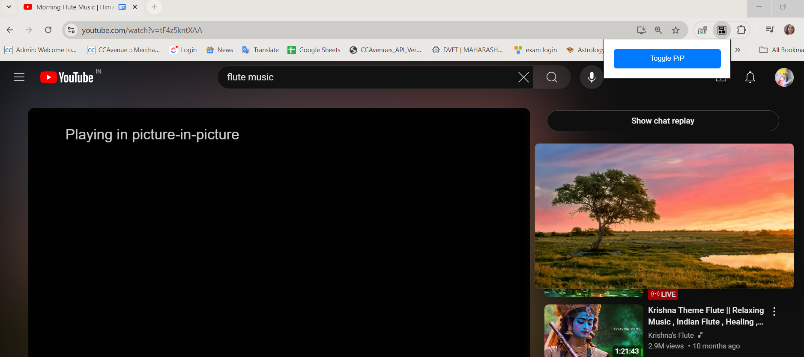

# PiP Chrome Extension

A simple Chrome extension to toggle Picture-in-Picture (PiP) mode for videos on any webpage.

## Table of Contents

- [Introduction](#introduction)
- [Features](#features)
- [Installation](#installation)
  - [From Source](#from-source)
  - [Via Chrome Web Store](#via-chrome-web-store)
- [Usage](#usage)
- [Screenshots](#screenshots)
- [Video Demonstration](#video-demonstration)
- [Contributing](#contributing)
- [License](#license)
- [FAQ](#faq)
- [Troubleshooting](#troubleshooting)
- [Changelog](#changelog)
- [Future Improvements](#future-improvements)
- [Technical Details](#technical-details)
- [Getting Started for Developers](#getting-started-for-developers)
- [Contact](#contact)

## Introduction

The PiP Chrome Extension allows users to toggle Picture-in-Picture mode for videos on any website. This feature is handy for keeping a video visible while browsing other tabs or multitasking.

## Features

- **Picture-in-Picture (PiP) Mode**: Easily enable or disable PiP mode for any HTML5 video.
- **Simple Interface**: A user-friendly button in the extension popup to quickly toggle PiP mode.
- **Broad Compatibility**: Works on most websites with standard HTML5 video elements.
- **Open Source**: Free to use and modify under the MIT License.

## Installation

### From Source

To install the PiP Chrome Extension from the source:

1. **Download the repository**:
   - Go to the [GitHub repository](https://github.com/puffy-me/PIP_2.0) and download the ZIP file or clone it using a Git client.

2. **Extract or navigate to the project directory**:
   - Extract the ZIP file if downloaded, or navigate to the directory where the repository is cloned.

3. **Load the extension in Chrome**:
   - Open Chrome and go to `chrome://extensions/`.
   - Enable "Developer mode" by toggling the switch in the top right corner.
   - Click "Load unpacked" and select the directory containing the `manifest.json` file.

### Via Chrome Web Store

1. Visit the [Chrome Web Store](https://chrome.google.com/webstore) and search for "PiP Mode."

2. Click "Add to Chrome" and follow the prompts to install the extension.

## Usage

1. Open a webpage with a video.
2. Click the PiP extension icon in the Chrome toolbar.
3. Toggle Picture-in-Picture mode by clicking the "Toggle PiP" button in the popup.

## Screenshots


*The PiP Mode extension popup.*

## Video Demonstration


*Video demonstration of the PiP Chrome Extension.*

## Contributing

We welcome contributions to the PiP Chrome Extension! To contribute:

1. Fork the repository on GitHub.
2. Create a new branch with your feature or bugfix.
3. Make your changes and commit them.
4. Push to your branch.
5. Open a pull request on GitHub.

## License

This project is licensed under the MIT License. See the LICENSE file for details.

## FAQ

**Q: Does this extension work on all websites?**  
A: It should work on most websites that use standard HTML5 video elements.

**Q: Can I use this extension on mobile browsers?**  
A: No, this extension is only supported on desktop versions of Chrome.

## Troubleshooting

**Problem**: The extension is not working on a specific website.  
**Solution**: Make sure the website uses standard HTML5 video elements. Some sites might use custom players that are not compatible.

**Problem**: The extension icon is not appearing in the toolbar.  
**Solution**: Ensure that the extension is installed and enabled in `chrome://extensions/`.

## Changelog

**v1.0.1 - 2024-08-27**
- **Fixed** bug that caused PiP mode to not activate on certain websites.
- **Improved** compatibility with custom video players.

**v1.0.0 - 2024-08-25**
- **Initial release** of PiP Chrome Extension.

## Future Improvements

- **Add** support for custom video players.
- **Implement** a dark mode for the popup interface.
- **Add** keyboard shortcuts for toggling PiP mode.
- **Localize** the extension for multiple languages.

## Technical Details

- **Language**: JavaScript
- **Framework**: None
- **APIs Used**:
  - Chrome Extensions API
  - Picture-in-Picture Web API
- **Directory Structure**:
  ```plaintext
  PIP_2.0/
  ├── background.js
  ├── manifest.json
  ├── popup.html
  ├── popup.js
  ├── popup.css
  ├── icon.png
  └── README.md

## Contact

For any questions or feedback, please contact us at puffy.meprojects@gmail.com.
